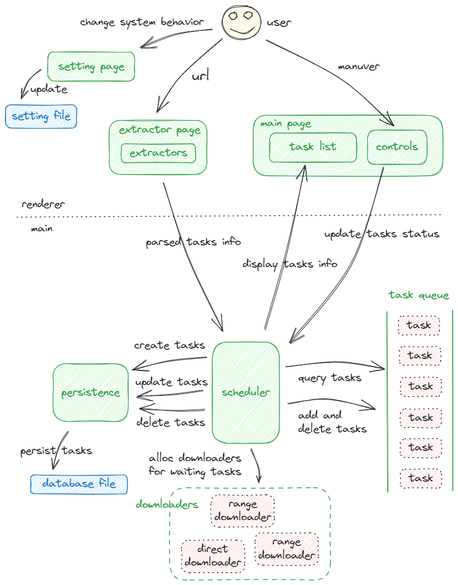
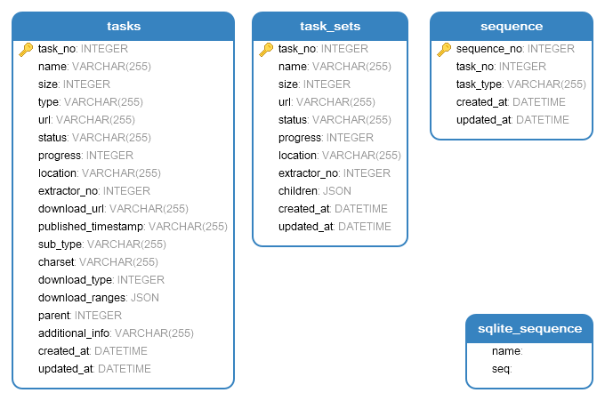

## http-downloader

http-downloader is a HTTP protocol based downloader and a video parser for video streaming websites, and it provides a succint GUI using Electron.

#### Functionalities

- HTTP downloading, supports adding and resuming from break points.

- Downloading videos from some commonly used video streaming websites.

Some functionalities need ffmpeg be in running Environment.

Here is the [todo list](./docs/todo.md).

#### Supported downloading types

- Resources which can be reached by HTTP request.

- bilibili single videos and video list.

- YouTube single videos.

#### Structure

#### Disclaimer

The software is only written and distributed for learning purpose, the author doesn't take responsibility for users' abuse of the software.